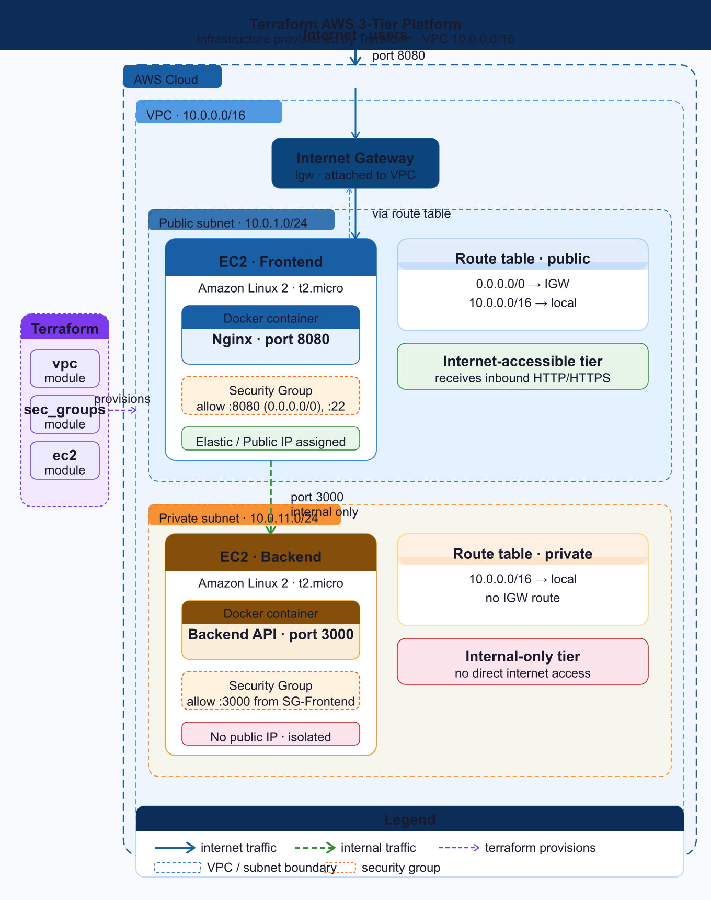
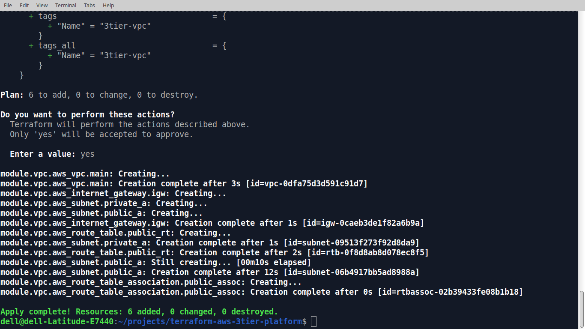
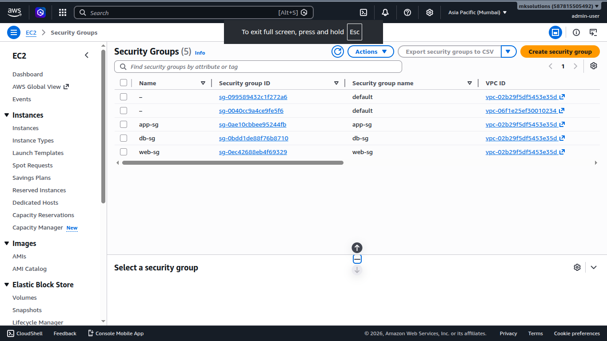
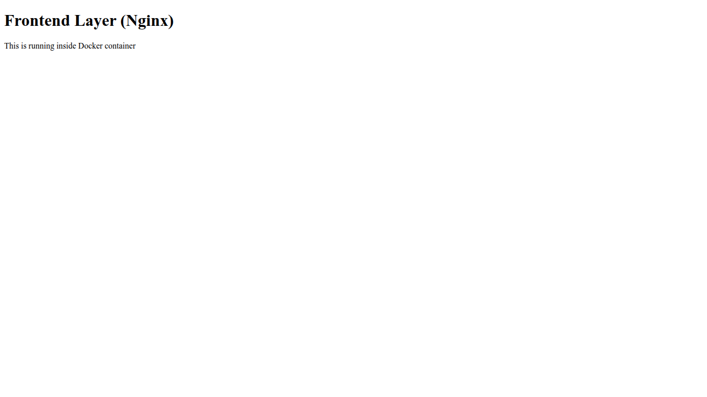
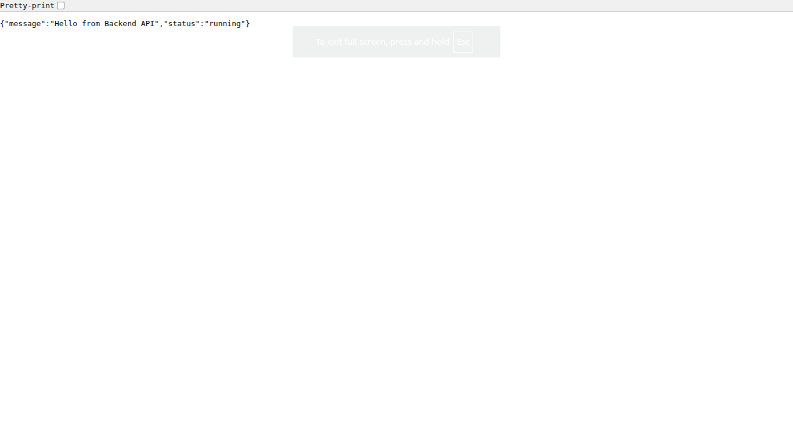

# 🚀 Terraform AWS 3-Tier Platform

<p align="center">
  
</p>

<p align="center">
  <b>Terraform • AWS • Docker • EC2 • VPC • Infrastructure as Code</b>
</p>

<p align="center">
  
  
  
  
</p>

---

## 📌 Project Overview

This project demonstrates how to build a modular AWS infrastructure using Terraform and Infrastructure as Code (IaC) principles.

The platform provisions:

* AWS VPC
* Public and Private Subnets
* Internet Gateway
* Route Tables
* Security Groups
* Frontend EC2 Instance
* Backend EC2 Instance
* Dockerized Application Stack
* Reusable Terraform Modules

The goal of this project is to showcase cloud infrastructure design, Terraform best practices, modular architecture, and AWS networking fundamentals.

---

## 🏗️ Architecture Diagram



### Architecture Flow

```text
Internet
    │
Internet Gateway
    │
VPC (10.0.0.0/16)
│
├── Public Subnet (10.0.1.0/24)
│     └── Frontend EC2
│            └── Dockerized Nginx
│            └── Port 8080
│
└── Private Subnet (10.0.11.0/24)
      └── Backend EC2
             └── Dockerized API
             └── Port 3000
```

---

## ⚙️ Technology Stack

| Technology      | Purpose                |
| --------------- | ---------------------- |
| Terraform       | Infrastructure as Code |
| AWS EC2         | Compute Resources      |
| AWS VPC         | Networking             |
| Security Groups | Access Control         |
| Docker          | Containerization       |
| Nginx           | Frontend Web Server    |
| Ubuntu Linux    | Operating System       |

---

## 📂 Repository Structure

```text
terraform-aws-3tier-platform/
├── diagrams/
│   ├── terraform-aws-3tier-platform.drawio
│   ├── terraform-aws-3tier-platform.png
│   └── terraform-aws-3tier-platform.svg
│
├── modules/
│   ├── ec2/
│   ├── security-groups/
│   └── vpc/
│
├── screenshots/
│
├── main.tf
├── provider.tf
├── variables.tf
├── outputs.tf
├── versions.tf
└── README.md
```

---

## 🧩 Terraform Modules

### VPC Module

Responsible for:

* VPC Creation
* Public Subnet
* Private Subnet
* Internet Gateway
* Route Tables

### Security Groups Module

Responsible for:

* Frontend Security Group
* Backend Security Group
* Access Rules

### EC2 Module

Responsible for:

* Frontend EC2 Instance
* Backend EC2 Instance
* Instance Networking

---

## 🚀 Deployment

### Initialize Terraform

```bash
terraform init
```

### Validate Configuration

```bash
terraform validate
```

### Create Execution Plan

```bash
terraform plan
```

### Deploy Infrastructure

```bash
terraform apply
```

### Destroy Infrastructure

```bash
terraform destroy
```

---

## 📊 Deployment Proof

### Terraform Apply



### AWS Resources


### Security Groups



### Frontend Application



### Backend API



---

## 🔐 Security Design

Implemented security controls:

* SSH Access via Key Pair Authentication
* Frontend Service exposed on Port 8080
* Backend Service restricted to internal communication
* Security Group based traffic control
* Infrastructure resources isolated within custom VPC

---

## 📤 Terraform Outputs

The project exposes useful deployment information:

* VPC ID
* Public Subnet ID
* Private Subnet ID
* Frontend Public IP
* Frontend Private IP
* Backend Private IP

View outputs:

```bash
terraform output
```

---

## 📚 Complete Project Walkthrough

Read the full technical article:

### 🌐 Website Article

https://devriston.com.pk/blog/terraform-aws-3tier-platform.html

### 📝 Dev.to

https://dev.to/muhammadkamrankabeeross

---

## 📖 Additional Documentation

Interview preparation notes:

```text
docs/interview-guide.md
```

---

## 🧠 Future Improvements

* Application Load Balancer (ALB)
* Auto Scaling Groups (ASG)
* S3 Remote Backend
* DynamoDB State Locking
* GitHub Actions CI/CD
* AWS CloudWatch Monitoring
* RDS Database Tier
* Multi-Environment Deployment

---

## 👨‍💻 Author

### Muhammad Kamran Kabeer

DevOps Engineer focused on Cloud Infrastructure, Linux, Terraform, AWS, Automation, and Infrastructure as Code.

🌐 Website: https://devriston.com.pk

📝 Dev.to: https://dev.to/muhammadkamrankabeeross

🐙 GitHub: https://github.com/muhammadkamrankabeer-oss

---

## ⭐ Support

If you found this project useful, consider giving it a star ⭐.
