# 🚀 Terraform AWS 3-Tier Platform

<p align="center">
  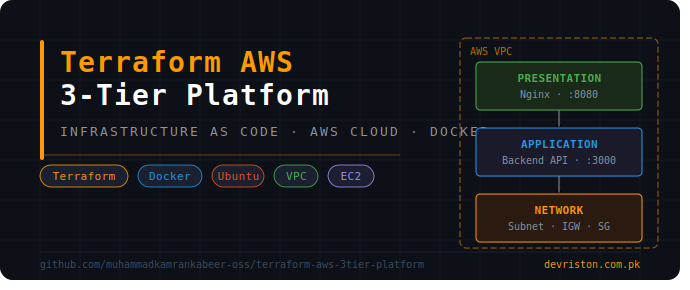
</p>
<p align="center">
  <b>Terraform • AWS • Docker • EC2 • VPC • Infrastructure as Code</b>
</p>

> Production-grade AWS 3-Tier Architecture automated with Terraform, modular IaC design, Docker-based application stack, and full EC2 networking on AWS.


---

## 📌 Overview

This project automates the deployment of a production-style **3-Tier AWS Infrastructure** using Terraform as Infrastructure as Code (IaC).

The architecture follows industry-standard 3-tier design principles separating concerns across:

- **Presentation Tier** — Frontend application served via Nginx on port `8080`
- **Application Tier** — Backend API service running on port `3000`
- **Network Tier** — Custom AWS VPC with public subnets, internet gateway, and route tables

The platform provisions real AWS cloud infrastructure, demonstrating end-to-end cloud engineering skills with modular, reusable Terraform code.

---

## ⚙️ Technology Stack

| Technology | Purpose |
| --- | --- |
| Terraform | Infrastructure as Code (IaC) |
| AWS EC2 | Cloud Compute Instances |
| AWS VPC | Custom Networking & Isolation |
| AWS Security Groups | Inbound / Outbound Traffic Rules |
| Docker | Application Containerization |
| Nginx | Frontend Reverse Proxy / Web Server |
| Ubuntu (Linux) | Server Operating System |
| SSH Key Pairs | Secure Instance Access |

---

## 🏗️ Architecture Overview

### Infrastructure Tiers

| Tier | Component | Purpose |
| --- | --- | --- |
| Presentation | Nginx Container (Port 8080) | Frontend web serving |
| Application | Backend Container (Port 3000) | API / Business Logic |
| Network | AWS VPC + Subnets + IGW | Cloud Networking Foundation |
| Security | AWS Security Groups | Traffic filtering & access control |
| Compute | AWS EC2 (Ubuntu) | Application hosting |

---

## 🌐 Infrastructure Flow

```
Developer Workstation
        │
        ├── Terraform CLI
        │         │
        │         └── AWS Provider
        │
        └── AWS Cloud
                  │
                  ├── VPC (Custom Network)
                  │         │
                  │         ├── Public Subnet
                  │         ├── Internet Gateway
                  │         └── Route Tables
                  │
                  ├── Security Groups
                  │         ├── Port 22  (SSH)
                  │         ├── Port 8080 (Frontend)
                  │         └── Port 3000 (Backend)
                  │
                  └── EC2 Instance (Ubuntu)
                            │
                            ├── Docker Engine
                            ├── Nginx Container → :8080
                            └── Backend Container → :3000
```

---

## 📂 Project Structure

```
terraform-aws-3tier-platform/
├── main.tf                   # Root module - orchestrates all resources
├── variables.tf              # Input variable declarations
├── provider.tf               # AWS provider configuration
├── terraform.tfvars          # Variable values
├── modules/
│   ├── vpc/
│   │   ├── main.tf           # VPC, Subnet, IGW, Route Tables
│   │   ├── variables.tf
│   │   └── outputs.tf
│   ├── security-groups/
│   │   ├── main.tf           # Security Group rules
│   │   ├── variables.tf
│   │   └── outputs.tf
│   └── ec2/
│       ├── main.tf           # EC2 instance, key pair, user data
│       ├── variables.tf
│       └── outputs.tf
├── environments/
│   └── dev/                  # Dev environment configurations
├── diagrams/                 # Architecture diagrams
├── screenshots/              # Deployment proof screenshots
├── terraform-key             # SSH private key (gitignored)
└── terraform-key.pub         # SSH public key
```

---

## 🚀 Core Features

| Feature | Description |
| --- | --- |
| ⚡ Modular IaC | Reusable Terraform modules for VPC, SG, EC2 |
| 🌐 Custom VPC | Dedicated AWS VPC with full network control |
| 🔐 Security Groups | Fine-grained inbound/outbound traffic rules |
| 🖥️ EC2 Provisioning | Automated Ubuntu instance deployment |
| 🐳 Docker Stack | Containerized frontend and backend applications |
| 🔑 SSH Key Management | Automated key pair generation and injection |
| 📁 Environment Separation | Dev/Prod environment directory structure |
| 🧠 Infrastructure as Code | Fully reproducible, version-controlled infrastructure |

---

## 🏢 Real-World Use Cases

This platform architecture can be adapted for:

- Production 3-tier web application deployments
- Microservices infrastructure on AWS
- DevOps learning labs and cloud training environments
- Startup MVP infrastructure on AWS
- CI/CD pipeline targets for application deployments
- Portfolio and technical demonstration projects
- AWS Certified Solutions Architect practice environments

---

## 📋 Prerequisites

| Requirement | Version |
| --- | --- |
| Terraform | >= 1.0 |
| AWS CLI | >= 2.0 |
| AWS Account | With IAM user + Access Keys |
| SSH Client | OpenSSH or equivalent |

---

## 🚀 Quick Start

### 1. Clone Repository

```bash
git clone https://github.com/muhammadkamrankabeer-oss/terraform-aws-3tier-platform.git

cd terraform-aws-3tier-platform
```

---

### 2. Configure AWS Credentials

```bash
aws configure
# Enter: AWS Access Key ID
# Enter: AWS Secret Access Key
# Enter: Default region (e.g. us-east-1)
```

---

### 3. Generate SSH Key Pair

```bash
ssh-keygen -t rsa -b 4096 -f terraform-key
```

---

### 4. Review Variables

```bash
# Edit terraform.tfvars with your values
nano terraform.tfvars
```

---

### 5. Initialize Terraform

```bash
terraform init
```

---

### 6. Plan Infrastructure

```bash
terraform plan
```

---

### 7. Apply Infrastructure

```bash
terraform apply
```

---

### 8. SSH into EC2 Instance

```bash
ssh -i terraform-key ubuntu@<EC2_PUBLIC_IP>
```

---

### 9. Destroy Infrastructure

```bash
terraform destroy
```

---

## 📊 Deployment Screenshots

### Terraform Init

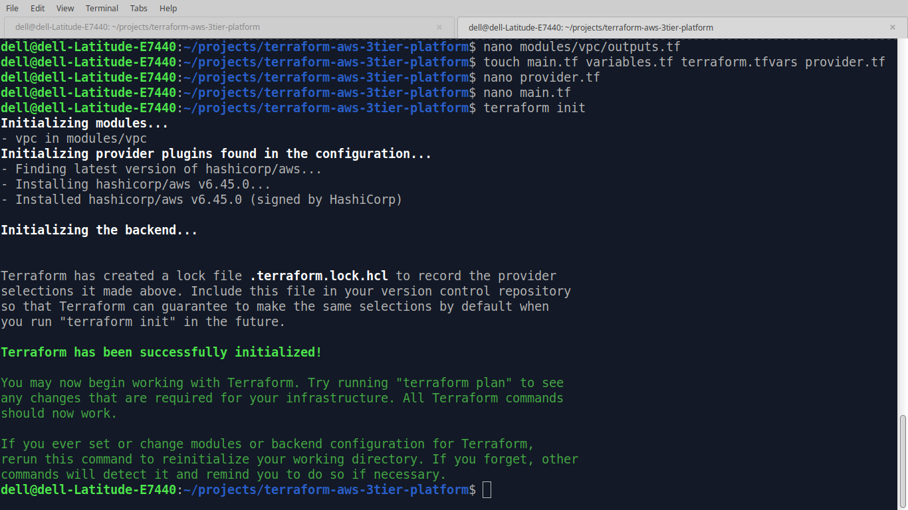

---

### Terraform Apply Complete

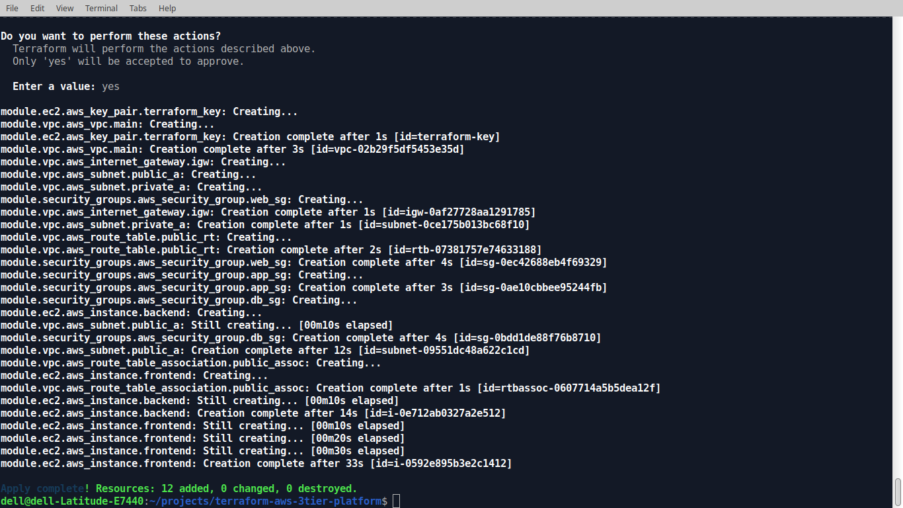

---

### AWS VPC on Console

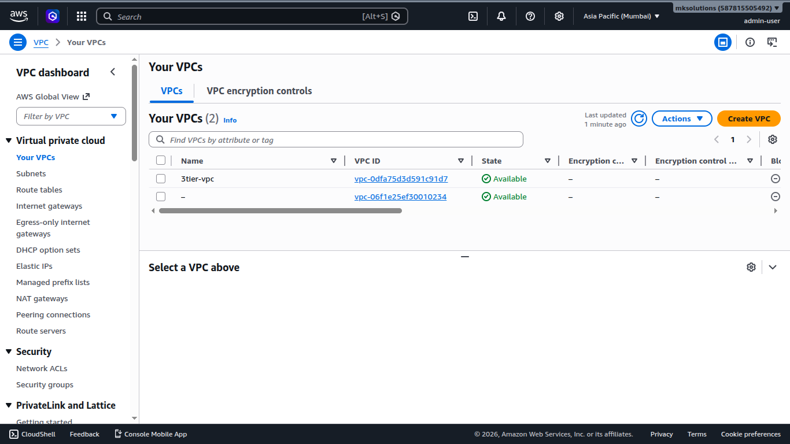

---

### EC2 Instance Running

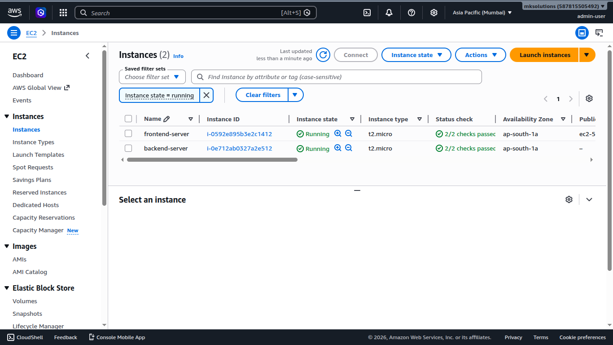

---

### EC2 SSH Access

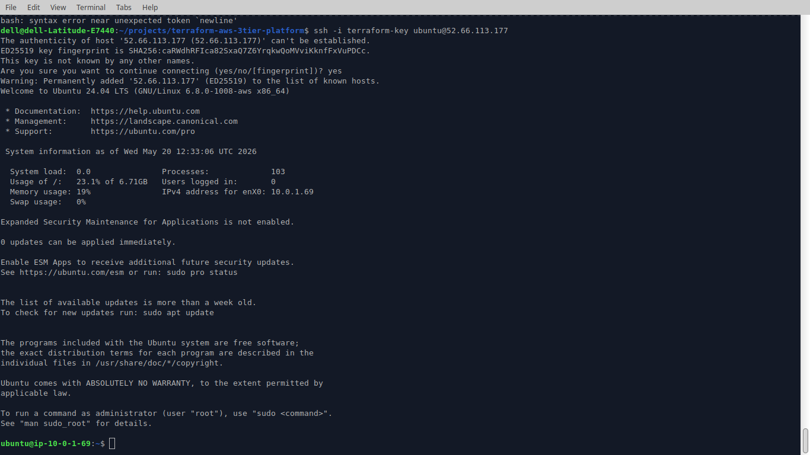

---

### Security Groups


---

### Inbound Rules (Ports 8080 & 3000)

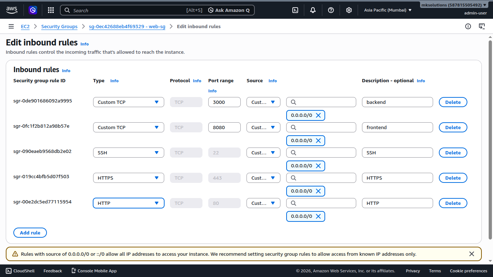

---

### Docker Images on EC2

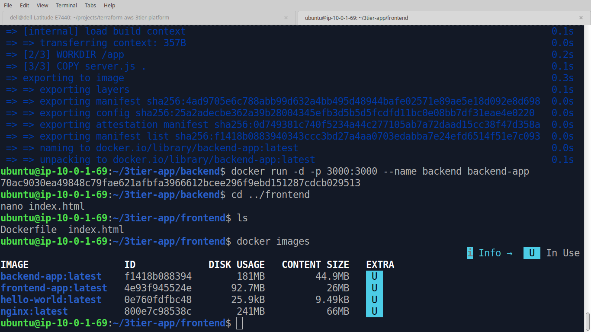

---

### Running Containers

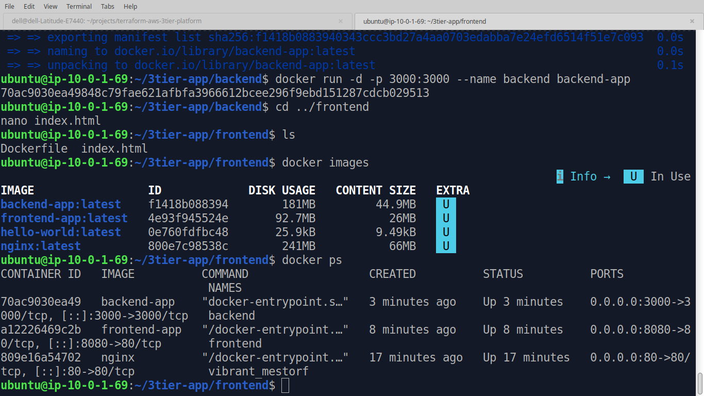

---

### Nginx Welcome Page

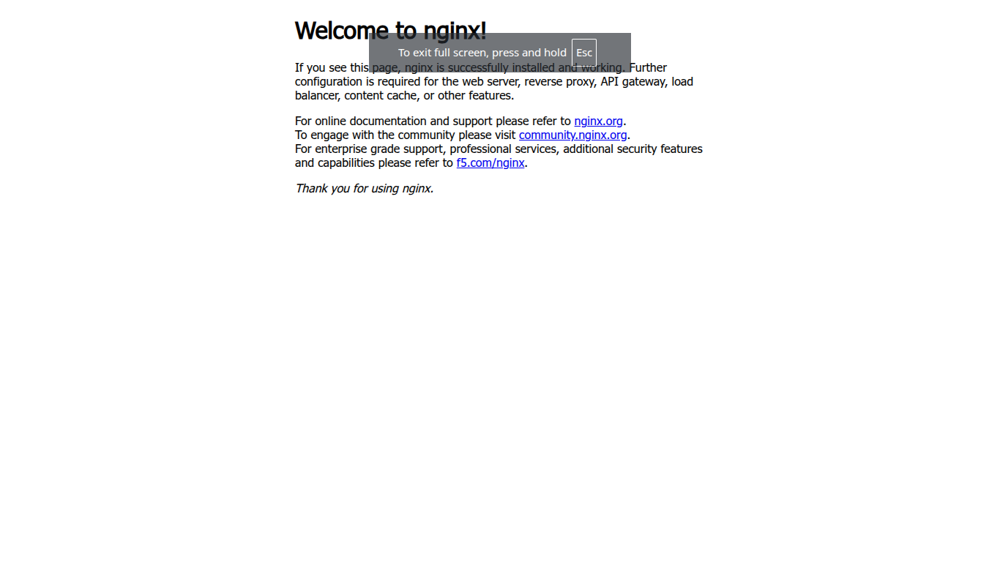

---

### Frontend (Port 8080)


---

### Backend (Port 3000)


---

### Terraform Destroy

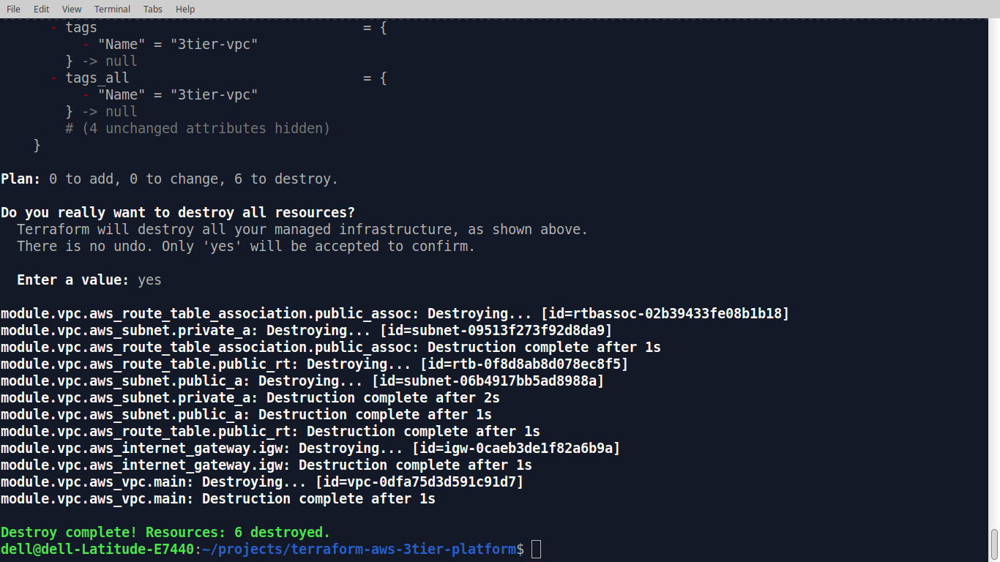

---

## 🔍 Useful Terraform Commands

### Check Current State

```bash
terraform show
```

---

### List Resources

```bash
terraform state list
```

---

### View Outputs

```bash
terraform output
```

---

### Format Code

```bash
terraform fmt
```

---

### Validate Configuration

```bash
terraform validate
```

---

## 🔐 Security Considerations

- SSH access restricted to port `22` with key-based authentication only
- Application ports `8080` and `3000` scoped via security group rules
- AWS IAM credentials managed via AWS CLI configuration (not hardcoded)
- SSH private key (`terraform-key`) excluded from version control via `.gitignore`
- Terraform state files excluded from version control

---

## 🧠 Skills Demonstrated

- Cloud Infrastructure Design (AWS)
- Infrastructure as Code (Terraform)
- Modular Terraform Architecture
- AWS Networking (VPC, Subnets, IGW, Route Tables)
- AWS Security Groups & Access Control
- EC2 Instance Provisioning
- Docker Application Containerization
- Linux System Administration
- SSH Key Management
- Terraform State Management
- Multi-environment IaC structuring
- Cloud Cost Awareness (destroy after demo)

---

## 🧩 Terraform Modules

| Module | Resources Managed |
| --- | --- |
| `modules/vpc` | VPC, Public Subnet, Internet Gateway, Route Table, Route Table Association |
| `modules/security-groups` | Security Group, Inbound Rules (22, 8080, 3000), Outbound Rules |
| `modules/ec2` | EC2 Instance, Key Pair, AMI Data Source, User Data |

---

## 🧠 Future Improvements

- [ ] Add private subnets for database tier
- [ ] Integrate AWS RDS for persistent data layer
- [ ] Add Application Load Balancer (ALB)
- [ ] Configure Auto Scaling Groups (ASG)
- [ ] Implement Terraform remote state with S3 + DynamoDB locking
- [ ] Add GitHub Actions CI/CD pipeline
- [ ] Integrate AWS CloudWatch monitoring
- [ ] Multi-environment support (staging, production)
- [ ] Add Terraform workspaces
- [ ] Deploy with HTTPS using ACM + Route 53

---

## 👨‍💻 Author

## Muhammad Kamran Kabeer

DevOps Engineer focused on cloud infrastructure, automation, Terraform, AWS, and Infrastructure as Code.

🌐 Website: https://www.devriston.com.pk

💼 LinkedIn: https://www.linkedin.com/in/kamrankabeer/

🐙 GitHub: https://github.com/muhammadkamrankabeer-oss

---

## ⭐ Support

If you found this project useful, consider giving it a star ⭐

This helps others discover the project and supports open-source cloud learning.
